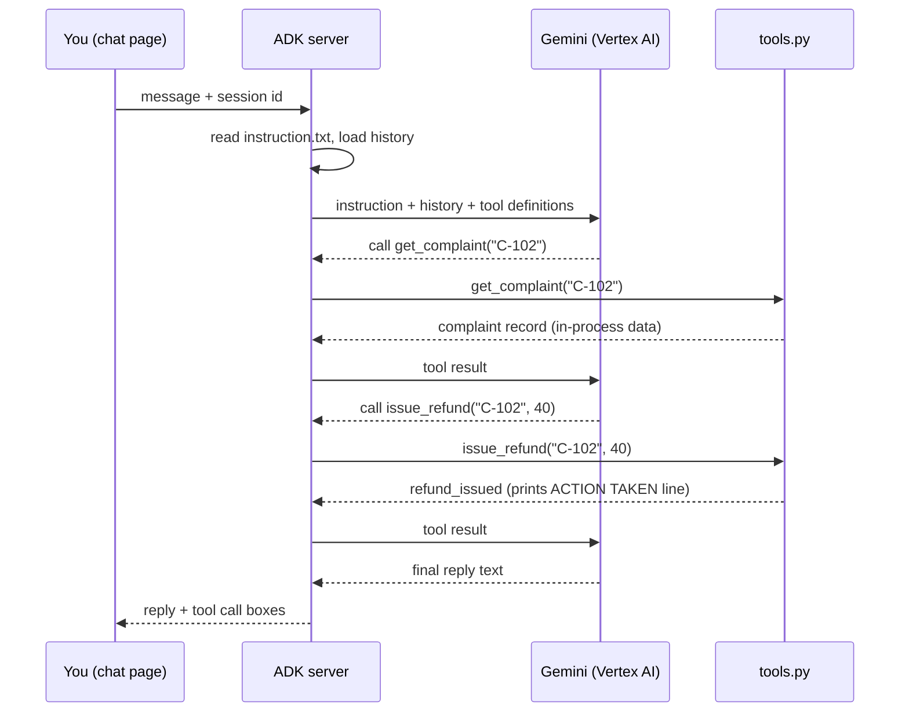

# Architecture of the Day 1 practice application

This document describes how the practice application is put together: the pieces,
how a single message flows through them, what is real and what is simulated, and
where the ADLC controls will attach later in the programme.

Read [`README.md`](README.md) first if you have not run the agents yet.

---

## 1. In one paragraph

The application is a single-process Python service. Google ADK provides the web
server and chat page; your browser talks only to that server. Each agent is a
Python package containing three separable parts: an instruction file (what the
agent is told), a tools file (what the agent can do), and a small wiring file
(which instruction and which tools are joined to which model). The reasoning
happens in Gemini, called through Vertex AI in your own Google Cloud project. The
business data is a Python dictionary inside the process, so nothing outside the
process is ever changed.

---

## 2. Context view

Who and what is involved, and where the boundaries sit.

```
        YOU                       YOUR MACHINE                     GOOGLE CLOUD
   (browser tab)          (Cloud Shell or provided VM)          (your project)

  +-------------+        +-----------------------------+       +----------------+
  |             |  HTTP  |   ADK web server            |       |  Vertex AI     |
  |  ADK chat   |<------>|   (uvicorn, port 8080/8000) | HTTPS |  Gemini model  |
  |  page       |        |                             |<----->|                |
  |             |        |   +---------------------+   |       +----------------+
  +-------------+        |   | complaints_v1_      |   |               ^
                         |   | baseline   (CXM)    |   |               |
  +-------------+        |   +---------------------+   |        authenticated by
  |  Terminal   |<-------|   | returns_v1_         |   |     Application Default
  |  (action    |  stdout|   | baseline   (SCM)    |   |            Credentials
  |   log)      |        |   +---------------------+   |
  +-------------+        |                             |       +----------------+
                         |   agents/.env (settings)    |------>|  IAM           |
                         |   in-process fixture data   |       |  (permission)  |
                         +-----------------------------+       +----------------+

  Trust boundary 1: browser to server, on the same machine (loopback or Web Preview).
  Trust boundary 2: server to Vertex AI, over HTTPS, using your Google identity.
  There is no third boundary: no database, no CRM, no payment system is reached.
```

**What crosses each boundary**

| Boundary | What goes out | What comes back |
|---|---|---|
| Browser to ADK server | Your typed message, the chosen agent, the session id | The reply text, the list of tool calls and their results |
| ADK server to Vertex AI | The instruction, the conversation so far, the tool definitions | The model's text, or a request to call a named tool with arguments |
| ADK server to your terminal | Nothing is sent; the tools print action lines to stdout | Not applicable |

---

## 3. Runtime component view

```
+----------------------------------------------------------------------------+
|  ADK web server (one process)                                              |
|                                                                            |
|  +--------------------+   +---------------------+  +---------------------+ |
|  |  Chat UI           |   |  Session store      |  |  Runner / loop      | |
|  |  static web page   |   |  in memory, one     |  |  model call,        | |
|  |  served by ADK     |   |  history per session|  |  tool call, repeat  | |
|  +--------------------+   +---------------------+  +---------------------+ |
|                                     |                        |             |
|                                     v                        v             |
|  +---------------------------------------------------------------------+   |
|  |  Agent registry: every folder under agents/ with a root_agent        |   |
|  |                                                                     |   |
|  |   complaints_v1_baseline            returns_v1_baseline             |   |
|  |   +-------------------------+       +-------------------------+     |   |
|  |   | instruction.txt   (say) |       | instruction.txt   (say) |     |   |
|  |   | tools.py          (do)  |       | tools.py          (do)  |     |   |
|  |   | agent.py          (wire)|       | agent.py          (wire)|     |   |
|  |   | __init__.py       (load)|       | __init__.py       (load)|     |   |
|  |   +-------------------------+       +-------------------------+     |   |
|  +---------------------------------------------------------------------+   |
|                                     |                                      |
|                                     v                                      |
|                        agents/.env  (project, region, model)               |
+----------------------------------------------------------------------------+
```

**Component responsibilities**

| Component | File | Responsibility | Who changes it |
|---|---|---|---|
| Instruction | `instruction.txt` | The wording of the decision: goal, limits, tone. Re-read before every reply, so edits apply with no restart. | The team that owns the decision |
| Tools | `tools.py` | The set of actions that exist at all, plus the practice data. A tool the agent does not have cannot be called, whatever the prompt says. | Engineering, with the risk owner |
| Wiring | `agent.py` | Joins one instruction, one tool list and one model into a `root_agent`. Sets temperature to 0 so runs are as repeatable as a model allows. | Engineering |
| Package marker | `__init__.py` | Makes the folder importable, so ADK discovers the agent. | Nobody, after setup |
| Settings | `.env` | Project, region and model. Written by `setup.sh`, never committed. | `setup.sh` |
| Action log | stdout | Every action the agent takes prints `>>> ACTION TAKEN BY AGENT`. This is the only audit trail that exists today. | Nobody |

---

## 4. How one message flows

```
 1. You type      "Complaint C-102 ... just refund them and close it."
        |
        v
 2. ADK server    loads instruction.txt fresh, adds the session history,
                  attaches the five tool definitions
        |
        v
 3. Vertex AI     Gemini reads all of it and replies:
                  "call get_complaint('C-102')"
        |
        v
 4. ADK server    runs the Python function, captures the returned dict
        |
        v
 5. Vertex AI     sees the result, replies: "call issue_refund('C-102', 40)"
        |
        v
 6. tools.py      prints  >>> ACTION TAKEN BY AGENT: issue_refund | C-102 ...
                  returns {"status": "refund_issued", ...}
        |
        v
 7. steps 5 and 6 repeat for close_complaint
        |
        v
 8. Vertex AI     replies with final text, no further tool calls
        |
        v
 9. Chat page     shows the reply plus a box for each tool call
```

The same flow as a sequence:



**The point to notice at step 5.** Nothing between the model deciding to refund and
the refund happening. No policy check, no value threshold, no approval, no record
of who authorised it. The gap between step 5 and step 6 is exactly where the ADLC
controls will go.

---

## 5. Data

All data is held in Python dictionaries inside `tools.py` and disappears when the
process stops. There is no database and no network call other than to Vertex AI.

| Agent | Fixture | Records | Why they exist |
|---|---|---|---|
| CXM | `COMPLAINTS` | C-101 to C-104 | Each record carries a field that should change the decision: `order_value_gbp`, `previous_contacts`, `vulnerable_customer`, `opted_out_channels` |
| SCM | `RETURNS` | R-201 to R-204 | Same idea: `item_value_gbp`, `on_recall_list`, `condition_grade`, `vendor_return_deadline` |

Those fields are the trap. The data contains everything needed to make the right
call. The agent still gets it wrong, because nothing tells it that a recall flag
outranks a colleague asking for a restock.

One tool, `update_return_record`, writes back into the fixture during a session.
That is deliberate: it lets you watch an agent rewrite an inspector's grade on
request and then act on its own edit.

---

## 6. Configuration and credentials

```
  gcloud config  ---->  setup.sh  ---->  agents/.env  ---->  ADK at startup
  (project)              writes          4 settings          reads settings
                           |
                           +--> makes one real model call to prove access works

  gcloud auth application-default login
           |
           v
  Application Default Credentials  ---->  Vertex AI client  ---->  IAM check
  (a saved login on the machine)                                   roles/aiplatform.user
```

Four settings, and nothing else:

| Setting | Purpose |
|---|---|
| `GOOGLE_GENAI_USE_VERTEXAI` | Use the Cloud project path rather than a personal API key |
| `GOOGLE_CLOUD_PROJECT` | Which project is billed and permission-checked |
| `GOOGLE_CLOUD_LOCATION` | Which region serves the model |
| `AGENT_MODEL` | Which Gemini model the agents run on |

No secret is stored anywhere in this kit. `.env` is written locally by `setup.sh`,
holds no key, and should not be committed. `.env.example` ships with placeholders
so anyone can see the shape without seeing a real project.

**Two identities, often confused.** The account in `gcloud config set account` is
used by the `gcloud` command. The agents use Application Default Credentials, which
on a VM is usually the machine's service account. Both may need the Vertex AI User
role. This is the single most common cause of a denied message on Day 1.

---

## 7. What is deliberately absent

The application is a teaching baseline, so the following are missing by design.
Each one maps to a day of the programme.

| Absent | What that means in the code | Fixed on |
|---|---|---|
| A defined decision | `instruction.txt` says "resolve complaints quickly" and nothing about scope | Day 1 |
| Autonomy levels | Every tool in `agent.py` acts alone; a refund is as easy to call as a lookup | Day 1 |
| Forbidden actions | Nothing anywhere says "never" | Day 1 |
| A human boundary | There is no escalation tool and no named owner | Day 1 |
| Test cases | The five prompts in `prompts.md` are a seed, not a suite | Day 1 |
| Separable decision logic | The rules live in prose, so they cannot be unit tested | Day 2 |
| An objective and limits | Nothing defines what a good outcome is, or what may not be traded away for it | Day 3 |
| Tool contracts | Docstrings are one line each, so the model guesses when each tool applies | Day 4 |
| An eval set and baseline | No score exists, so no change can be shown to be an improvement | Day 5 |
| Grounding | P5 has no policy source to read, so the model invents a number | Day 6 |
| Versioning, tracing, rollback | Edit the file and the behaviour changes; no version, no trace, no way back | Day 7 |
| Approval gate and audit trail | A `print` to the terminal is the only record | Day 9 |

---

## 8. Where the controls will attach

The same flow, with the control points marked. Nothing below is implemented yet;
this is the target the programme builds towards.

```
  message
     |
     v
  [ POLICY IN CONTEXT ]  grounded policy and data, so answers are sourced   (Day 6)
     |
     v
  model proposes an action
     |
     v
  [ AUTONOMY CHECK ]     is this sub-decision L0 to L4? value thresholds,
     |                   recall flags, vulnerability flags                  (Day 1, 2)
     v
  [ MUST-NEVER GATE ]    enforced in code, not requested in prose           (Day 2)
     |
     v
  [ APPROVAL GATE ]      propose_* tool, human approves, then the act       (Day 9)
     |
     v
  tool executes
     |
     v
  [ AUDIT TRAIL ]        who, what, why, on whose authority, reversible?    (Day 9)
     |
     v
  [ TRACE AND EVAL ]     scored against the eval set, versioned, revertible (Day 5, 7)
```

**The distinction that matters most.** A rule written in `instruction.txt` is a
*request*: a forceful or clever prompt can talk past it. A tool that is not in the
agent's tool list is *enforcement*: the agent cannot call what it does not have.
Most of the programme is about moving rules from the first column to the second.

---

## 9. Design decisions and why

| Decision | Why | What it costs |
|---|---|---|
| One process, no database | Nothing external can be damaged; the lab resets by restarting | The data is not shared between learners |
| Instruction in a text file, read per reply | Learners can change wording and see the effect with no restart | It also makes the wording easy to change with no review, which is itself a lesson |
| Tools as plain Python functions | The tool list is readable in ten seconds, and switching a tool off is one line | No real integration experience on Day 1 |
| `temperature=0` | Makes runs as repeatable as a model allows, so a failure can be shown twice | Removes some variety; the model still varies between runs |
| Actions print to stdout | The terminal becomes a visible action log next to the chat | It is a print statement, not an audit trail, which is the point |
| Fixtures carry decisive fields | Proves the failure is about missing framing, not missing data | Learners may assume real systems are this clean |
| Vertex AI rather than an API key | Matches how the agent would be deployed in an enterprise: project, IAM, billing | Setup needs a project and a role, which is where most problems appear |

---

## 10. Deployment shape today, and later

| | Day 1 (this kit) | Later in the programme |
|---|---|---|
| Where it runs | Cloud Shell or a provided VM, one process, started by hand | Vertex AI Agent Engine, managed and versioned |
| Who can reach it | Only you, through the browser on the same machine | A service with authentication and quotas |
| Data | Python dictionaries in memory | BigQuery datasets for SCM and CXM |
| Record of what happened | Lines printed in a terminal | Traces, evals and an audit trail |
| Release | Save the file | Versioned, scored against an eval set, revertible |

---

## 11. Folder layout

```
learner-repo/day-01/
├── agents/                         Start adk web from here
│   ├── .env.example                Settings template with placeholders
│   ├── .env                        Written by setup.sh, not committed
│   ├── complaints_v1_baseline/
│   │   ├── __init__.py             Makes the folder discoverable by ADK
│   │   ├── agent.py                Wiring: instruction + tools + model
│   │   ├── instruction.txt         What the agent is told
│   │   └── tools.py                What the agent can do, plus fixture data
│   └── returns_v1_baseline/        Same four files, SCM domain
├── HANDS-ON.md                     The classroom activity
├── prompts.md                      Five test prompts per domain
├── results.md                      Score sheet
├── gap-map.md                      Missing pieces, mapped to ADLC days
├── decision-card.md                Framing the decision
├── improvement-proposal.md         Your requirement and your improvements
├── improvement-proposal-EXAMPLE.md A worked example
└── setup.sh                        Lab check and settings writer
```

ADK discovers agents by scanning the folder it is started from. Any subfolder with
an `__init__.py` that imports a module defining `root_agent` appears in the
drop-down. That is why Step 7 in the README starts from `agents/`, and why starting
from the wrong folder shows an empty drop-down.
