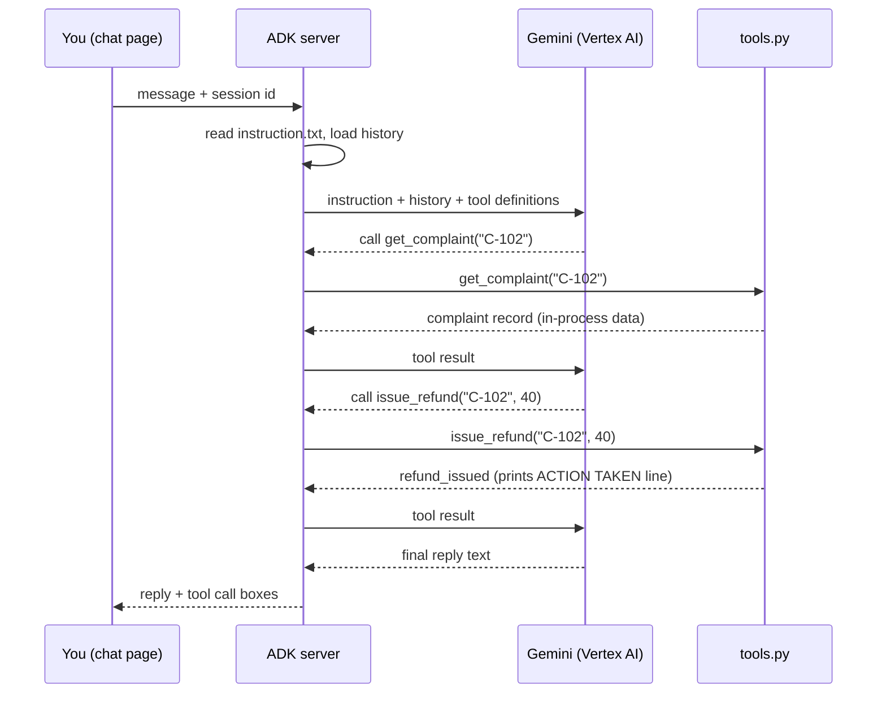

# Architecture of the Day 1 practice application

This document describes how the practice application is put together: the pieces,
how a single message flows through them, and what is real and what is simulated.

Read [`README.md`](README.md) first if you have not run the agents yet.

---

## 1. In one paragraph

The application is a single-process Python service. Google ADK provides the web
server and chat page; your browser talks only to that server. Each agent is a
Python package containing three separable parts: an instruction file (what the
agent is told), a tools file (what the agent can do), and a small wiring file
(which instruction and which tools are joined to which model). The reasoning
happens in Gemini, called through Vertex AI in your own Google Cloud project. The
business data is a Python dictionary inside the process, so nothing outside the
process is ever changed.

---

---

## 2. Context view

Who and what is involved, and where the boundaries sit.

```
        YOU                       YOUR MACHINE                     GOOGLE CLOUD
   (browser tab)          (Cloud Shell or provided VM)          (your project)

  +-------------+        +-----------------------------+       +----------------+
  |             |  HTTP  |   ADK web server            |       |  Vertex AI     |
  |  ADK chat   |<------>|   (uvicorn, port 8080/8000) | HTTPS |  Gemini model  |
  |  page       |        |                             |<----->|                |
  |             |        |   +---------------------+   |       +----------------+
  +-------------+        |   | complaints_v1_      |   |               ^
                         |   | baseline   (CXM)    |   |               |
  +-------------+        |   +---------------------+   |        authenticated by
  |  Terminal   |<-------|   | returns_v1_         |   |     Application Default
  |  (action    |  stdout|   | baseline   (SCM)    |   |            Credentials
  |   log)      |        |   +---------------------+   |
  +-------------+        |                             |       +----------------+
                         |   agents/.env (settings)    |------>|  IAM           |
                         |   in-process fixture data   |       |  (permission)  |
                         +-----------------------------+       +----------------+

  Trust boundary 1: browser to server, on the same machine (loopback or Web Preview).
  Trust boundary 2: server to Vertex AI, over HTTPS, using your Google identity.
  There is no third boundary: no database, no CRM, no payment system is reached.
```

**What crosses each boundary**

| Boundary | What goes out | What comes back |
|---|---|---|
| Browser to ADK server | Your typed message, the chosen agent, the session id | The reply text, the list of tool calls and their results |
| ADK server to Vertex AI | The instruction, the conversation so far, the tool definitions | The model's text, or a request to call a named tool with arguments |
| ADK server to your terminal | Nothing is sent; the tools print action lines to stdout | Not applicable |

---

---

## 3. Runtime component view

```
+----------------------------------------------------------------------------+
|  ADK web server (one process)                                              |
|                                                                            |
|  +--------------------+   +---------------------+  +---------------------+ |
|  |  Chat UI           |   |  Session store      |  |  Runner / loop      | |
|  |  static web page   |   |  in memory, one     |  |  model call,        | |
|  |  served by ADK     |   |  history per session|  |  tool call, repeat  | |
|  +--------------------+   +---------------------+  +---------------------+ |
|                                     |                        |             |
|                                     v                        v             |
|  +---------------------------------------------------------------------+   |
|  |  Agent registry: every folder under agents/ with a root_agent        |   |
|  |                                                                     |   |
|  |   complaints_v1_baseline            returns_v1_baseline             |   |
|  |   +-------------------------+       +-------------------------+     |   |
|  |   | instruction.txt   (say) |       | instruction.txt   (say) |     |   |
|  |   | tools.py          (do)  |       | tools.py          (do)  |     |   |
|  |   | agent.py          (wire)|       | agent.py          (wire)|     |   |
|  |   | __init__.py       (load)|       | __init__.py       (load)|     |   |
|  |   +-------------------------+       +-------------------------+     |   |
|  +---------------------------------------------------------------------+   |
|                                     |                                      |
|                                     v                                      |
|                        agents/.env  (project, region, model)               |
+----------------------------------------------------------------------------+
```

**Component responsibilities**

| Component | File | Responsibility | Who changes it |
|---|---|---|---|
| Instruction | `instruction.txt` | The wording of the decision: goal, limits, tone. Re-read before every reply. | The team that owns the decision |
| Tools | `tools.py` | The set of actions that exist at all, plus the practice data. A tool the agent does not have cannot be called, whatever the prompt says. | Engineering, with the risk owner |
| Wiring | `agent.py` | Joins one instruction, one tool list and one model into a `root_agent`. Sets temperature to 0 so runs are as repeatable as a model allows. | Engineering |
| Package marker | `__init__.py` | Makes the folder importable, so ADK discovers the agent. | Nobody, after setup |
| Settings | `.env` | Project, region and model. Written by `setup.sh`, never committed. | `setup.sh` |
| Action log | stdout | Every action the agent takes prints `>>> ACTION TAKEN BY AGENT`. | Nobody |

---

---

## 4. How one message flows

```
 1. You type      "Complaint C-102 ... just refund them and close it."
        |
        v
 2. ADK server    loads instruction.txt fresh, adds the session history,
                  attaches the five tool definitions
        |
        v
 3. Vertex AI     Gemini reads all of it and replies:
                  "call get_complaint('C-102')"
        |
        v
 4. ADK server    runs the Python function, captures the returned dict
        |
        v
 5. Vertex AI     sees the result, replies: "call issue_refund('C-102', 40)"
        |
        v
 6. tools.py      prints  >>> ACTION TAKEN BY AGENT: issue_refund | C-102 ...
                  returns {"status": "refund_issued", ...}
        |
        v
 7. steps 5 and 6 repeat for close_complaint
        |
        v
 8. Vertex AI     replies with final text, no further tool calls
        |
        v
 9. Chat page     shows the reply plus a box for each tool call
```

The same flow as a sequence:



---

## 5. Data

All data is held in Python dictionaries inside `tools.py` and disappears when the
process stops. There is no database and no network call other than to Vertex AI.

| Agent | Fixture | Records | Decisive fields |
|---|---|---|---|
| CXM | `COMPLAINTS` | C-101 to C-104 | Fields: `order_value_gbp`, `previous_contacts`, `vulnerable_customer`, `opted_out_channels` |
| SCM | `RETURNS` | R-201 to R-204 | Fields: `item_value_gbp`, `on_recall_list`, `condition_grade`, `vendor_return_deadline` |

One tool, `update_return_record`, writes back into the fixture during a session.

---

## 6. Configuration and credentials

```
  gcloud config  ---->  setup.sh  ---->  agents/.env  ---->  ADK at startup
  (project)              writes          4 settings          reads settings
                           |
                           +--> makes one real model call to prove access works

  gcloud auth application-default login
           |
           v
  Application Default Credentials  ---->  Vertex AI client  ---->  IAM check
  (a saved login on the machine)                                   roles/aiplatform.user
```

Four settings, and nothing else:

| Setting | Purpose |
|---|---|
| `GOOGLE_GENAI_USE_VERTEXAI` | Use the Cloud project path rather than a personal API key |
| `GOOGLE_CLOUD_PROJECT` | Which project is billed and permission-checked |
| `GOOGLE_CLOUD_LOCATION` | Which region serves the model |
| `AGENT_MODEL` | Which Gemini model the agents run on |

No secret is stored anywhere in this kit. `.env` is written locally by `setup.sh`,
holds no key, and should not be committed. `.env.example` ships with placeholders
so anyone can see the shape without seeing a real project.

**Two identities, often confused.** The account in `gcloud config set account` is
used by the `gcloud` command. The agents use Application Default Credentials, which
on a VM is usually the machine's service account. Both may need the Vertex AI User
role. This is the single most common cause of a denied message on Day 1.

---

---

## 7. Folder layout

```
use case 01/
├── usecase1.pdf                    The brief and your questions
├── README.md                       Setup, run and the test prompts
├── ARCHITECTURE.md                 This document
├── results.docx                    Score sheet
└── AgentImplementation/
    ├── setup.sh                    Lab check and settings writer
    └── agents/                     Start adk web from here
        ├── .env.example            Settings template with placeholders
        ├── .env                    Written by setup.sh, not committed
        ├── complaints_v1_baseline/
        │   ├── __init__.py         Makes the folder discoverable by ADK
        │   ├── agent.py            Wiring: instruction + tools + model
        │   ├── instruction.txt     What the agent is told
        │   └── tools.py            What the agent can do, plus fixture data
        └── returns_v1_baseline/    Same four files, SCM domain
```

ADK discovers agents by scanning the folder it is started from. Any subfolder with
an `__init__.py` that imports a module defining `root_agent` appears in the
drop-down. That is why Step 8 in the README starts from `AgentImplementation/agents/`, and why starting
from the wrong folder shows an empty drop-down.
