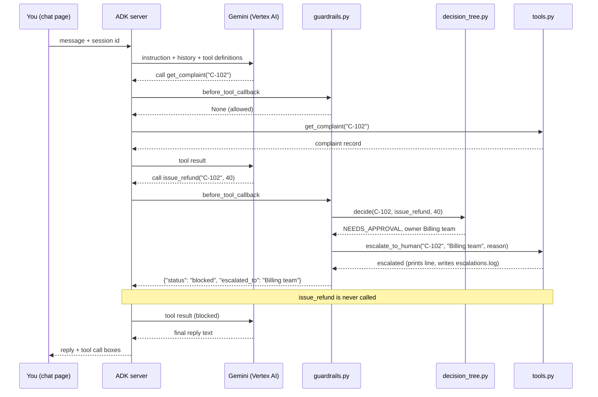

# Architecture of the Day 2 practice application

This document describes how the Day 2 application is put together: what was added to
the Day 1 agent, how a single action flows through the decision tree, how escalation
works, and what is real and what is simulated.

Read [`README.md`](README.md) first if you have not run the agents yet. The base
application (ADK server, Vertex AI, credentials) is the same as Day 1.

---

## 1. In one paragraph

The application is still a single-process Python service. Google ADK provides the web
server and chat page, and Gemini on Vertex AI does the reasoning. What is new is a
layer between the model and the tools. `complaints_v2_decision` has the same model,
data and tools as `complaints_v1_baseline`, plus a **decision tree** written in plain
Python and a **guardrail** that ADK runs before every tool call. The model can ask for
any action; the guardrail asks the tree whether it is allowed. If it is not, the tool
never runs, the complaint is escalated to a named person automatically, and one line
is written to `escalations.log`. The tree has no ADK import and makes no model call,
so it can be tested on its own in under a second.

---

## 2. Context view

Who and what is involved, and where the boundaries sit.

```
        YOU                       YOUR MACHINE                     GOOGLE CLOUD
   (browser tab)                  (provided VM)                  (your project)

  +-------------+        +-----------------------------+       +----------------+
  |             |  HTTP  |   ADK web server            | HTTPS |  Vertex AI     |
  |  ADK chat   |<------>|   (uvicorn, port 8000)      |<----->|  Gemini model  |
  |  page       |        |                             |       +----------------+
  |             |        |   complaints_v1_baseline    |               ^
  +-------------+        |   complaints_v2_decision    |        authenticated by
                         |     + guardrail             |     Application Default
  +-------------+        |     + decision tree         |            Credentials
  |  Terminal   |<-------|                             |
  |  (>>> lines)|  stdout|   agents/.env (settings)    |       +----------------+
  +-------------+        |   in-process fixture data   |------>|  IAM           |
                         +--------------+--------------+       |  (permission)  |
                                        |                      +----------------+
                                        | append one line
                                        v  per escalation
                         +-----------------------------+
                         |  escalations.log  (VM disk) |
                         +-----------------------------+

  Trust boundary 1: browser to server, on the same machine (loopback).
  Trust boundary 2: server to Vertex AI, over HTTPS, using your Google identity.
  There is no third boundary: no database, no CRM, no payment system, no email or
  ticketing system is reached. The log file is on the same machine.
```

**What crosses each boundary**

| Boundary | What goes out | What comes back |
|---|---|---|
| Browser to ADK server | Your typed message, the chosen agent, the session id | The reply text, the tool calls and their results, including blocked ones |
| ADK server to Vertex AI | The instruction, the conversation so far, the tool definitions | The model's text, or a request to call a named tool with arguments |
| ADK server to your terminal | Action, escalation and block lines on stdout | Not applicable |
| ADK server to the VM disk | One line per escalation, appended to `escalations.log` | Not applicable |

The decision tree and the guardrail run **inside** the ADK process, on your machine.
Nothing about the rules is sent to Google except the instruction text and the results
the guardrail returns to the model.

---

## 3. Runtime component view

```
+----------------------------------------------------------------------------+
|  ADK web server (one process)                                              |
|                                                                            |
|  +--------------------+   +---------------------+  +---------------------+ |
|  |  Chat UI           |   |  Session store      |  |  Runner / loop      | |
|  |  static web page   |   |  history and state, |  |  model call,        | |
|  |  served by ADK     |   |  one per session    |  |  tool call, repeat  | |
|  +--------------------+   +---------------------+  +---------------------+ |
|                                     |                        |             |
|                                     v                        v             |
|  +---------------------------------------------------------------------+   |
|  |  Agent registry: every folder under agents/ with a root_agent        |   |
|  |                                                                     |   |
|  |   complaints_v1_baseline         complaints_v2_decision             |   |
|  |   +----------------------+       +-------------------------------+  |   |
|  |   | instruction.txt (say)|       | instruction.txt       (say)   |  |   |
|  |   | tools.py        (do) |       | tools.py              (do)    |  |   |
|  |   | agent.py      (wire) |       | decision_tree.py      (decide)|  |   |
|  |   | __init__.py   (load) |       | guardrails.py         (check) |  |   |
|  |   +----------------------+       | agent.py              (wire)  |  |   |
|  |                                  | __init__.py           (load)  |  |   |
|  |                                  +-------------------------------+  |   |
|  +---------------------------------------------------------------------+   |
|                                     |                                      |
|                                     v                                      |
|                        agents/.env  (project, region, model)               |
+----------------------------------------------------------------------------+
```

**Component responsibilities**

| Component | File | Responsibility | Who changes it |
|---|---|---|---|
| Instruction | `instruction.txt` | What the agent decides, the five rules in words, and how to explain an escalation. Read once when the server starts. | The complaints team lead |
| Tools | `tools.py` | The Day 1 actions and practice data, plus `escalate_to_human`, which writes `escalations.log`. | Engineering, with the risk owner |
| Decision tree | `decision_tree.py` | The five rules, their order, the refund limit, the word lists and the owner for each rule. Plain Python, no ADK, no model. | Engineering, with sign-off from the team lead |
| Guardrail | `guardrails.py` | The ADK `before_tool_callback`. Checks each tool call against the tree, escalates when a rule applies, and decides whether the tool runs. | Engineering |
| Wiring | `agent.py` | Joins the instruction, the six tools, the guardrail and the model into a `root_agent`. Temperature 0. | Engineering |
| Package marker | `__init__.py` | Makes the folder importable, so ADK discovers the agent. | Nobody, after setup |
| Tests | `tests/test_decision_tree.py` | Five scenarios, one per rule. Imports the tree and the data directly, never the agent. | Whoever changes the tree |
| Settings | `agents/.env` | Project, region and model. Written by `setup.sh`, never committed. | `setup.sh` |
| Escalation log | `escalations.log` | The human queue: one line per escalation, kept after the server stops. | Nobody; read by the owners |

**Where the line sits in the code.** Two layers, deliberately separate.

| Layer | Files | Can the model get around it? |
|---|---|---|
| Guardrail layer | `decision_tree.py`, `guardrails.py`, the tool list in `agent.py` | No. It runs outside the model, before the tool. |
| Reasoning space | `instruction.txt`, Gemini | Yes, in principle. The instruction is a request to the model, not a check. |

Which rule belongs to which control plane is your job in Worksheet E.

---

## 4. How one action flows

The same prompt as Day 1, through the Day 2 agent.

```
 1. You type      "Complaint C-102 ... just refund them and close it."
        |
        v
 2. ADK server    adds the instruction and session history, attaches six tools
        |
        v
 3. Vertex AI     Gemini replies: "call get_complaint('C-102')"
        |
        v
 4. guardrails.py lookup: does rule 1 apply to C-102? No.  -> tool runs
        |
        v
 5. Vertex AI     sees the record, replies: "call issue_refund('C-102', 40)"
        |
        v
 6. guardrails.py asks decision_tree.decide(C-102, issue_refund, 40)
                  tree answers: NEEDS_APPROVAL, owner Billing team
        |
        v
 7. tools.py      escalate_to_human('C-102', 'Billing team', reason)
                  prints  >>> ESCALATED TO HUMAN: C-102 -> Billing team
                  appends one line to escalations.log
                  session state: C-102 is now with a person
        |
        v
 8. guardrails.py prints  >>> BLOCKED BY GUARDRAIL: issue_refund | C-102 | NEEDS_APPROVAL
                  returns {"status": "blocked", "escalated_to": "Billing team", ...}
                  issue_refund in tools.py never runs
        |
        v
 9. Vertex AI     may try close_complaint('C-102')
                  guardrail: C-102 is with a person  -> BLOCKED, WITH_HUMAN
        |
        v
10. Vertex AI     replies with final text: what was not done, why, and who has it
        |
        v
11. Chat page     shows the reply plus a box for each tool call, blocked ones included
```

The same flow as a sequence:



### What the guardrail does with each tool call

ADK calls `before_tool_callback(tool, args, tool_context)` before every tool. If the
function returns `None`, the tool runs. If it returns a dictionary, the tool does not
run and the dictionary goes back to the model as the tool's result. The guardrail
works through these checks in order:

| # | Tool call | What the guardrail does |
|---|---|---|
| 1 | `get_complaint` | If rule 1 applies (vulnerable or legal words), escalate straight away and return the record with `escalated_to` added. Otherwise let it run. |
| 2 | `escalate_to_human` (called by the model) | If the complaint is already with a person, return `already_escalated` instead of a second escalation. Otherwise let it run. |
| 3 | `route_complaint` | Always allowed. |
| 4 | Refund, close or message on an unknown complaint ID | Block with `UNKNOWN_COMPLAINT`. Nothing to escalate. |
| 5 | Refund or close on a complaint already with a person | Block with `WITH_HUMAN`. |
| 6 | Refund, close or message otherwise | Ask the tree. If allowed, let it run. If not, escalate to the rule's owner, then block. |

---

## 5. The decision tree and escalation

`decide(complaint, tool_name, args)` checks the rules top to bottom. The first rule
that matches decides, and every rule that stops the agent names an owner.

| Rule | Applies to | Checks | Result | Owner |
|---|---|---|---|---|
| 1 `ESCALATE` | Lookup, refund, close | `vulnerable_customer` flag, or complaint text contains a word in `LEGAL_WORDS` | Stop | Complaints team lead |
| 2 `OPTED_OUT_CHANNEL` | Message | `channel` is in `opted_out_channels` | Stop | Complaints team lead |
| 3 `NO_OFFER_POLICY` | Message | Message text contains a word in `OFFER_WORDS` | Stop | Complaints team lead |
| 4 `NEEDS_APPROVAL` | Refund | `amount_gbp` is greater than `REFUND_LIMIT_GBP` (25) | Stop | Billing team |
| 5 `ALLOWED` | Anything else | Nothing matched | Tool runs | None |

**Escalation is done by the code, not by the model.** When a rule stops an action,
`guardrails.py` calls `escalate_to_human` itself before it tells the model anything.
The model only learns afterwards, through the `escalated_to` field in the result, and
the instruction tells it to explain that to the user. The model can also call
`escalate_to_human` on its own for cases the rules do not cover.

**Session state.** The guardrail remembers two things in ADK session state:

| Key | Set when | Used for |
|---|---|---|
| `with_human:<complaint>` | The first escalation for that complaint in the session | Blocking refund and close (`WITH_HUMAN`), and answering `already_escalated` |
| `escalated:<complaint>:<rule>` | A rule escalates that complaint | Writing each complaint and rule to the log only once |

State belongs to one session. **New Session** starts with empty state. Depending on the
ADK version, sessions are kept in memory, or in `agents/complaints_v2_decision/.adk/session.db`
on the VM.

---

## 6. Data

The complaint data is the Day 1 fixture, copied unchanged into the v2 `tools.py`.
It is held in a Python dictionary and nothing writes back into it.

| Agent | Fixture | Records | Fields the tree reads |
|---|---|---|---|
| CXM v1 and v2 | `COMPLAINTS` | C-101 to C-104 | `text`, `vulnerable_customer`, `opted_out_channels` |

The tree does not read `order_value_gbp` or `previous_contacts`. Refund size comes
from the tool call, not the record.

**The escalation log.** Plain text, one line per escalation, appended and never
rewritten:

```
<time UTC> | <complaint> | <owner> | [<rule>] <reason> Attempted: <tool and arguments>
```

It is written to `usecase01_day2/escalations.log`, outside the `agents/` folder, and is
covered by the repository's `.gitignore`.

---

## 7. Testing without the model

```
  tests/test_decision_tree.py
          |
          | imports directly (not the agent package)
          v
  decision_tree.py  +  tools.py (for COMPLAINTS)
          |
          v
  5 scenarios: complaint + tool call  ->  expected rule and owner
```

`decision_tree.py` and `tools.py` import nothing from ADK or Google, so the test runs
with plain `python3`: no virtual environment, no credentials, no network. The test
adds the agent folder to Python's path and imports the two files by name, which avoids
loading `__init__.py` and `agent.py`.

The scenarios are the specification. If a test fails, either the tree or the code is
wrong; the scenario is not edited to make it pass. README step 9 shows this by
changing the refund limit.

---

## 8. Configuration and credentials

Unchanged from Day 1, except where the files sit.

```
  gcloud config  ---->  setup.sh  ---->  agents/.env  ---->  ADK at startup
  (project)              writes          4 settings          reads settings
                           |
                           +--> makes one real model call to prove access works

  gcloud auth application-default login
           |
           v
  Application Default Credentials  ---->  Vertex AI client  ---->  IAM check
  (a saved login on the machine)                                   roles/aiplatform.user
```

| Setting | Purpose |
|---|---|
| `GOOGLE_GENAI_USE_VERTEXAI` | Use the Cloud project path rather than a personal API key |
| `GOOGLE_CLOUD_PROJECT` | Which project is billed and permission-checked |
| `GOOGLE_CLOUD_LOCATION` | Which region serves the model |
| `AGENT_MODEL` | Which Gemini model the agents run on |

No secret is stored anywhere in this kit. `setup.sh` writes `usecase01_day2/agents/.env`
locally; it holds no key and should not be committed. The decision tree tests need
none of these settings.

**Two identities, often confused.** The account in `gcloud config set account` is used
by the `gcloud` command. The agents use Application Default Credentials, which on a VM
is usually the machine's service account. Both may need the Vertex AI User role.

---

## 9. What is real and what is simulated

| Real | Simulated |
|---|---|
| The model's reasoning and tool choices (Gemini on Vertex AI) | Refunds, messages, routing and closures: each only prints a line |
| The guardrail check, before every tool call | The complaint data: four made-up records |
| The block: a stopped tool never runs | Escalation: a log line and a terminal line; nobody is emailed, paged or given a ticket |
| The escalation log on the VM disk | The owners: "Complaints team lead" and "Billing team" are roles, not people |
| The five tests and their result | Approval: there is no way yet for a person to approve and release a blocked action |

---

## 10. Folder layout

```
usecase01_day2/                         $KIT
├── README.md                           Setup, run and the test prompts
├── README-training-account.md          The same, pre-filled for the training account
├── ARCHITECTURE.md                     This document
├── usecase1_day2.pdf                   The brief and your questions
├── Day2_Worksheets_UC01.docx           Your worksheets
├── setup.sh                            Lab check and settings writer
├── escalations.log                     Created at the first escalation
├── tests/
│   └── test_decision_tree.py           Five scenarios, no model
└── agents/                             Start adk web from here
    ├── .env                            Written by setup.sh, not committed
    ├── complaints_v1_baseline/         Day 1 agent, unchanged
    │   ├── __init__.py
    │   ├── agent.py
    │   ├── instruction.txt
    │   └── tools.py
    └── complaints_v2_decision/
        ├── __init__.py                 Makes the folder discoverable by ADK
        ├── agent.py                    Wiring: instruction + tools + guardrail + model
        ├── instruction.txt             What the agent is told
        ├── tools.py                    Day 1 tools and data, plus escalate_to_human
        ├── decision_tree.py            The five rules
        ├── guardrails.py               The before_tool_callback
        └── .adk/                       May be created by ADK to store sessions
```

ADK discovers agents by scanning the folder it is started from. Any subfolder with an
`__init__.py` that imports a module defining `root_agent` appears in the drop-down.
`tests/` sits outside `agents/`, so it never appears there. That is why step 10 in the
README starts from `usecase01_day2/agents/`, and why starting from the wrong folder
shows an empty drop-down.
