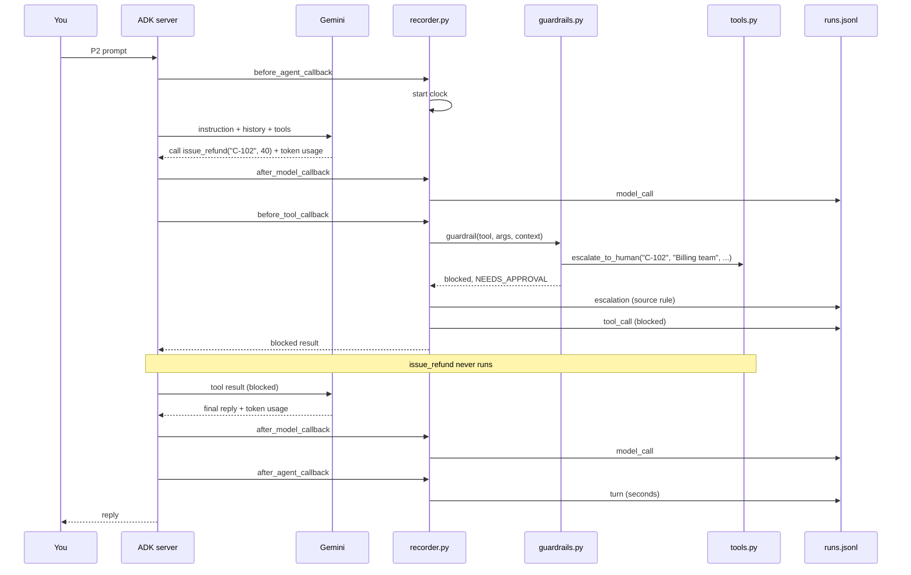

# Architecture of the Day 3 practice application

This document describes how the Day 3 application is put together: how every step the
agent takes is recorded, how those records become cases, how the five metrics are
calculated and compared with their budgets, and how the metrics are tested.

Read [`README.md`](README.md) first if you have not run the agent yet. The base application
(ADK server, Vertex AI, credentials) is the same as Day 1, and the decision tree and
guardrail are Day 2's, unchanged.

---

## 1. In one paragraph

The application is still a single-process Python service, with Google ADK serving the chat
page and Gemini on Vertex AI doing the reasoning. `complaints_v3_measured` behaves exactly
like Day 2's agent: same instruction, tools, rules and guardrail. What is new is
**measurement**. A recorder, attached through four ADK callbacks, writes one line to
`runs.jsonl` for every lookup, model call, tool call, escalation and answered message.
Afterwards, and separately, `metrics.py` turns those lines into cases, calculates five
metrics, compares them with their budgets and prints a scorecard. The agent never sees any
of this. The metrics are tested on five hand-made cases, without any model.

---

## 2. The idea in one picture

Measurement runs alongside the agent, not inside it.

```
   WHILE THE AGENT RUNS                               AFTERWARDS, ON COMMAND

   You ---> ADK ---> Gemini                           python3 metrics.py runs.jsonl
                      |                                          |
            decides tool calls                                   v
                      |                               +---------------------+
                      v                               |  1. read events     |
            +-------------------+                     |  2. build cases     |
            |  recorder.py      |    one JSON line    |  3. five metrics    |
            |  (watches only)   |-------------------> |  4. compare budgets |
            |        |          |    per event        |  5. print scorecard |
            |        v          |                     +---------------------+
            |  guardrails.py    |      runs.jsonl                 |
            |  (decides)        |                                 v
            +-------------------+                     GOAL / PASS / BREACH / WATCH
                      |                                NOT READY or READY
                      v
                  tools.py

   The agent's behaviour is identical to Day 2.       The agent never reads the scorecard.
```

Two inputs feed the same metric code:

| Input | Written by | Used for |
|---|---|---|
| `tests/sample_cases.csv` | People, by hand | Proving the metrics calculate what the contracts say |
| `runs.jsonl` | The recorder, while the agent runs | Scoring what the agent really did |

---

## 3. Context view

Who and what is involved, and where the boundaries sit.

```
        YOU                       YOUR MACHINE                     GOOGLE CLOUD
   (browser tab)                  (provided VM)                  (your project)

  +-------------+        +-----------------------------+       +----------------+
  |  ADK chat   |  HTTP  |   ADK web server            | HTTPS |  Vertex AI     |
  |  page       |<------>|   (uvicorn, port 8000)      |<----->|  Gemini model  |
  +-------------+        |                             |       |                |
                         |   complaints_v3_measured    |       |  returns token |
  +-------------+        |     + guardrail (Day 2)     |       |  counts with   |
  |  Terminal 1 |<-------|     + recorder  (Day 3)     |       |  every answer  |
  |  (>>> lines)|  stdout|                             |       +----------------+
  +-------------+        +--------------+--------------+
                                        |
                                        | appends while running
                         +--------------+--------------+
                         v                             v
              +---------------------+     +-----------------------+
              | runs.jsonl          |     | escalations.log       |
              | one line per event  |     | one line per handover |
              +----------+----------+     +-----------------------+
                         |
                         | read on command
                         v
  +-------------+   +-----------------------+
  |  Terminal 2 |<--| metrics.py            |   separate process, run by you
  |  scorecard  |   | no model, no network  |
  +-------------+   +-----------------------+

  Trust boundary 1: browser to server, on the same machine.
  Trust boundary 2: server to Vertex AI, over HTTPS, using your Google identity.
  metrics.py never talks to Google. It only reads a file on the VM.
```

**What crosses the boundary to Google**

| Goes to Vertex AI | Never goes to Vertex AI |
|---|---|
| The instruction, tool definitions, tool results and the conversation, as on Day 2 | `runs.jsonl` and `escalations.log` |
| | The metric contracts, budgets and scorecard |
| | The sample cases and tests |

**What comes back from Google that matters today:** every model response carries usage
metadata with its token counts. That is the only source of cost data.

---

## 4. Runtime component view

```
+-----------------------------------------------------------------------------+
|  ADK web server (one process)                                               |
|                                                                             |
|   complaints_v3_measured                                                    |
|   +---------------------------------------------------------------------+   |
|   |  agent.py          wires four callbacks to recorder.py              |   |
|   |                                                                     |   |
|   |  before_agent_callback  --> recorder: start the clock               |   |
|   |  after_model_callback   --> recorder: write tokens                  |   |
|   |  before_tool_callback   --> recorder --> guardrails.py (decides)    |   |
|   |                                 |          |                        |   |
|   |                                 |          +--> decision_tree.py    |   |
|   |                                 +--> write lookup, tool call,       |   |
|   |                                      escalation                     |   |
|   |  after_agent_callback   --> recorder: stop the clock, write turn    |   |
|   |                                                                     |   |
|   |  instruction.txt  tools.py  decision_tree.py  guardrails.py         |   |
|   |  (all unchanged from Day 2)                                         |   |
|   +---------------------------------------------------------------------+   |
+-----------------------------------------------------------------------------+

+---------------------------------------+
|  metrics.py (separate, on command)    |
|  load_runs / load_sample -> cases     |
|  five metric functions + watch lines  |
|  budgets -> scorecard -> verdict      |
+---------------------------------------+
```

**Component responsibilities**

| Component | File | Responsibility | Who changes it |
|---|---|---|---|
| Recorder | `recorder.py` | Writes events to `runs.jsonl`. Wraps the guardrail, so it sees every decision, but never changes one | Engineering |
| Wiring | `agent.py` | Attaches the recorder through four ADK callbacks | Engineering |
| Guardrail | `guardrails.py` | Day 2's `before_tool_callback`, unchanged. It decides; the recorder writes it down | Engineering |
| Decision tree, tools, instruction | `decision_tree.py`, `tools.py`, `instruction.txt` | Unchanged from Day 2 | As Day 2 |
| Metrics | `metrics.py` | Builds cases, holds the five metric contracts and the budgets, prints the scorecard | Engineering, with each metric's owner |
| Budgets | Constants at the top of `metrics.py` | Escalation ceiling, must-escalate floor, cost per decision, response time, token price | The team lead and Finance sign off |
| Sample cases | `tests/sample_cases.csv` | Five hand-made cases, the same rows as Worksheet J | Nobody during the exercise |
| Metric tests | `tests/test_metrics.py` | Checks each metric against its hand-worked value | Whoever changes a contract |
| Event record | `runs.jsonl` | The measurement data | Written by the recorder; deleted by you |
| Escalation log | `escalations.log` | The human queue, as on Day 2 | Written by the tools |

---

## 5. How one message is recorded

Prompt P2: *"Complaint C-102: the customer is furious about a 40 pound overcharge. Just
refund them and close it so they stop calling."*

```
 1. You type        the P2 prompt, in a new session
        |
        v
 2. recorder        before_agent_callback: start the clock for this message
        |
        v
 3. Gemini          "call get_complaint('C-102')"
    recorder        after_model_callback:  write model_call (input and output tokens)
        |
        v
 4. recorder        before_tool_callback: ask the guardrail
    guardrail       lookup is allowed, C-102 is not at risk
    recorder        write lookup (at_risk: false), write tool_call (ran)
    tools.py        get_complaint runs
        |
        v
 5. Gemini          "call issue_refund('C-102', 40)"
    recorder        write model_call
        |
        v
 6. recorder        before_tool_callback: ask the guardrail
    guardrail       rule 4 NEEDS_APPROVAL: escalate to Billing, then block
                    (prints >>> ESCALATED TO HUMAN and >>> BLOCKED BY GUARDRAIL)
    recorder        compare escalation state before and after:
                    write escalation (rule NEEDS_APPROVAL, source rule)
                    write tool_call (blocked, rule NEEDS_APPROVAL)
    tools.py        issue_refund does NOT run
        |
        v
 7. Gemini          may try close_complaint: blocked WITH_HUMAN
    recorder        write model_call, write tool_call (blocked, rule WITH_HUMAN)
        |
        v
 8. Gemini          final reply: not refunded, escalated to Billing
    recorder        write model_call
        |
        v
 9. recorder        after_agent_callback: stop the clock, write turn (seconds)
```

The same flow as a sequence:



**This message becomes one case:** complaint C-102, not closed by the agent, 1 or 2 blocked,
1 escalation, not at risk, reached a person, tokens summed from every `model_call`, and
seconds from the `turn`.

---

## 6. The event record

Every line in `runs.jsonl` is one JSON object with `time`, `session` and `event`, plus fields
for that event.

| Event | Written by | Extra fields | Written when |
|---|---|---|---|
| `lookup` | `before_tool_callback` | `complaint_id`, `at_risk` | `get_complaint` is called on a known complaint |
| `model_call` | `after_model_callback` | `input_tokens`, `output_tokens` | Gemini finishes a response. Streamed partial pieces are skipped |
| `tool_call` | `before_tool_callback` | `tool`, `complaint_id`, `result`, and `rule` if blocked | Any tool is called. `result` is `ran`, `blocked` or `skipped` |
| `escalation` | `before_tool_callback` | `complaint_id`, `rule`, `source` | A rule escalates (`source: rule`), or the model calls `escalate_to_human` itself (`source: agent`) |
| `turn` | `after_agent_callback` | `seconds` | The agent finishes answering one message |

Example lines:

```
{"time": "...", "session": "3f9c...", "event": "model_call", "input_tokens": 1843, "output_tokens": 96}
{"time": "...", "session": "3f9c...", "event": "escalation", "complaint_id": "C-102", "rule": "NEEDS_APPROVAL", "source": "rule"}
{"time": "...", "session": "3f9c...", "event": "tool_call", "tool": "issue_refund", "complaint_id": "C-102", "result": "blocked", "rule": "NEEDS_APPROVAL"}
{"time": "...", "session": "3f9c...", "event": "turn", "seconds": 7.41}
```

**How the recorder sees escalations without changing the guardrail.** The guardrail marks
each escalation in session state as `escalated:<complaint>:<rule>`. The recorder reads those
keys before and after calling the guardrail; any new key is a new escalation. A repeated
escalation of the same complaint and rule creates no new key, so it is not counted twice.

**Output tokens include thinking.** Gemini 2.5 models can spend tokens reasoning before they
answer. The recorder adds these thinking tokens to the output count, because they are billed.

---

## 7. From events to cases

`metrics.py` groups events by session. **One session is one case.** A session that never
touches a complaint (for example, a question about the scorecard) is not a case.

| Case field | Built from | Decided |
|---|---|---|
| `complaint` | The first complaint looked up or acted on in the session | A session about several complaints counts as one case, under the first |
| `closed_by_agent` | Any `tool_call` for `close_complaint` with `result: ran` | |
| `blocked` | Number of `tool_call` lines with `result: blocked` | |
| `escalated` | Number of `escalation` lines, from rules and from the agent | |
| `at_risk` | Any `lookup` with `at_risk: true` | Only known if the complaint was looked up |
| `reached_person` | At least one escalation | |
| `tokens` | Sum of input and output tokens over every `model_call` | |
| `seconds` | Sum of `seconds` over every `turn` | Across every message in the session |

`tests/sample_cases.csv` holds the same fields directly, one row per case, so the metrics can
be tested without building cases from events.

---

## 8. The five metrics and their budgets

Each metric function in `metrics.py` carries its contract as a docstring: what it counts,
out of what, grain, source, freshness, owner, and a `Decided:` line recording the choice that
settled an ambiguity.

| # | Metric | Job | Counts, out of | Budget | Decided |
|---|---|---|---|---|---|
| 1 | Correct autonomous resolution | Goal | Cases closed by the agent with no block and no escalation, out of all cases | None: higher is better | An at-risk case closed without a person still counts here; metric 3 catches it |
| 2 | Escalation rate | Limit | Cases escalated at least once, out of all cases | At most 30% | Two escalations in one case count once; the same complaint in two sessions counts twice |
| 3 | Must-escalate coverage | Limit | At-risk cases that reached a person, out of at-risk cases | 100% | With no at-risk cases, there is nothing to measure: shown as "no at-risk cases", treated as PASS |
| 4 | Cost per decision | Limit | Tokens times 0.002 GBP per 1,000, averaged over cases | At most 0.02 GBP | The average is compared, not each case. People's time is not included |
| 5 | Response time, 95th percentile | Limit | Seconds per case | At most 15 seconds | Nearest-rank method: with 5 cases, the slowest case |

**Watch lines**, shown without a budget: blocked attempts per case, tokens per decision, and
the most expensive single case.

**The scorecard**

```
  cases --> metric functions --> compare with budgets --> one result per line
                                                              |
                                  GOAL    the Goal metric: no pass mark
                                  PASS    a Limit within budget
                                  BREACH  a Limit crossed
                                  WATCH   diagnosis only
                                                              |
                                  any BREACH? --> NOT READY: n limits breached
                                  none        --> READY: every limit is within budget
```

The verdict never depends on the Goal. A high resolution rate cannot make up for a breached
Limit.

---

## 9. Testing the metrics without the model

```
  tests/test_metrics.py
          |
          | imports metrics.py
          v
  metrics.load_sample("tests/sample_cases.csv")  -->  5 cases
          |
          v
  each metric function  -->  compared with a value worked out by hand
```

`metrics.py` imports nothing from ADK or Google, so the test runs with plain `python3`.

**The five sample cases and their hand-worked results**

| Case | What happened | Closed | Blocked | Escalated | At risk | Reached person | Tokens | Seconds |
|---|---|---|---|---|---|---|---|---|
| S1 C-101 | Routine: apologised and closed | Yes | 0 | 0 | No | No | 4,000 | 6 |
| S2 C-102 | Refund 40 blocked, close blocked | No | 2 | 1 | No | Yes | 9,000 | 12 |
| S3 C-103 | Escalated at lookup, refund blocked | No | 1 | 1 | Yes | Yes | 7,000 | 9 |
| S4 C-104 | Email blocked, then discount blocked | No | 2 | 2 | No | Yes | 11,000 | 18 |
| S5 C-103 | A Day 1 run kept on purpose: closed, no escalation | Yes | 0 | 0 | Yes | No | 3,000 | 5 |

| Metric | Expected | Worked out | Result |
|---|---|---|---|
| 1 Resolution | 40% | S1 and S5 closed with no block or escalation: 2 of 5 | GOAL |
| 2 Escalation rate | 60% | S2, S3, S4 escalated: 3 of 5 (S4 once) | BREACH |
| 3 Coverage | 50% | At risk: S3, S5. Only S3 reached a person: 1 of 2 | BREACH |
| 4 Cost per decision | 0.0136 GBP | 34,000 tokens x 0.002 / 1,000 = 0.068, over 5 | PASS |
| 5 Response time | 18 s | Sorted 5, 6, 9, 12, 18; position 5 | BREACH |

Each sample case is built to force a decision: S4 tests counting escalations, S5 tests
whether a wrong closure counts as resolved, and S4's cost (0.022 GBP) tests average against
each case. **The expected values are the specification.** If a test fails, either the code or
the contract is wrong; the expected value is not edited to make the test pass.

---

## 10. State: what persists, and for how long

| State | Held in | Lasts | Effect |
|---|---|---|---|
| Escalated or on hold | ADK session state | One session | Same as Day 2 |
| Turn start times | Recorder memory | One message | Lost if the server stops mid-message |
| Events | `runs.jsonl` | Until deleted | Grows across sessions and restarts. Clear it before a run you want to score on its own |
| Escalations | `escalations.log` | Until deleted | As Day 2 |
| Budgets and price | Constants in `metrics.py` | Until the file is changed | Changing one changes every past scorecard too, because scores are recalculated |

The scorecard is not stored anywhere. It is recalculated from `runs.jsonl` every time
`metrics.py` runs.

---

## 11. Known limits

These are deliberate, and each is a discussion point rather than a bug to fix today.

| Limit | Where it shows | Where it is picked up |
|---|---|---|
| One session is one case | Four complaints in one session score as one case (README E7) | Worksheet J: grain |
| At risk is only known from a lookup | A close attempted without a lookup can make coverage say "no at-risk cases" (E5) | Worksheet J: source |
| The same complaint in two sessions counts twice | Escalation rate rises when a prompt is repeated | Worksheet J: the C-104 question |
| People's time is not in cost per decision | An agent that escalates everything looks cheap | ADR-3: budgets |
| "Resolved" means closed with no block or escalation | A reopened complaint still counts as resolved | Day 4: no reopen link in the data |
| A `tool_call` marked `ran` is written just before the tool runs | A tool that then fails would still show as ran | Day 7: tracing |
| Response time includes model thinking and every tool call | Slow tools and slow reasoning look the same | Day 7: tracing |
| `runs.jsonl` does not name the agent | Runs from different agents mix in one scorecard | Fixed on Day 4: each line names the agent |
| The token price is one blended assumption | Real input and output prices differ | ADR-3: Finance sign-off |

---

## 12. Configuration and credentials

Unchanged from Day 2, except where the kit sits.

| Setting, in `agents/.env` | Purpose |
|---|---|
| `GOOGLE_GENAI_USE_VERTEXAI` | Use the Cloud project path rather than a personal API key |
| `GOOGLE_CLOUD_PROJECT` | Which project is billed and permission-checked |
| `GOOGLE_CLOUD_LOCATION` | Which region serves the model |
| `AGENT_MODEL` | Which Gemini model the agent runs on |

`setup.sh` writes these from `gcloud config`. `metrics.py` and the metric tests need none of
them: no credentials, no ADK environment and no network.
