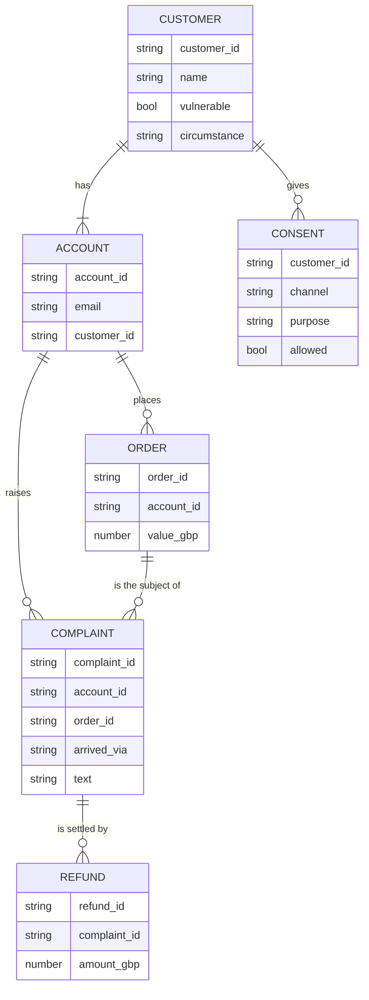
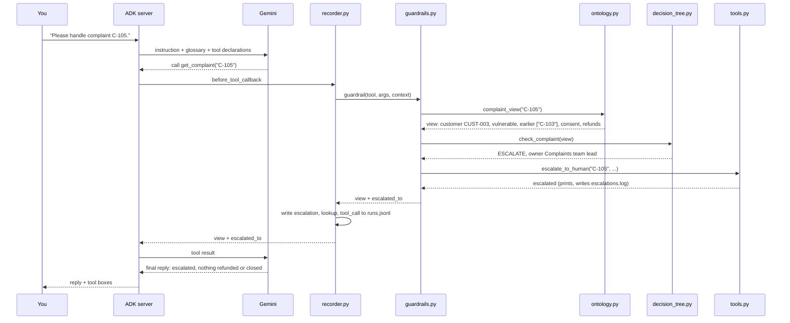

# Architecture of the Day 4 practice application

This document describes how the Day 4 application is put together: where the meanings of
words live, how they reach the agent, how one action flows through the ontology and the
rules, and how the ontology is tested.

Read [`README.md`](README.md) first if you have not run the agents yet. The base
application (ADK server, Vertex AI, credentials) is the same as Day 1. The guardrail is
Day 2's, and the recorder and scorecard are Day 3's.

---

## 1. In one paragraph

The application is still a single-process Python service, with Google ADK serving the chat
page and Gemini on Vertex AI doing the reasoning. Day 4 adds **meaning**. `ontology.yaml`
says what each word means, which thing it belongs to and what must always be true.
`data/northwind.json` holds linked records: customers, accounts, orders, complaints, refunds
and consents. `ontology.py` follows the links between them, so when the agent looks up a
complaint, the customer, consent and refunds come attached. The same five rules from Day 2
now use those defined meanings. The model never reads `ontology.yaml`; the meanings reach it
through **tool descriptions, parameter types and a short glossary** in the instruction.
Tests check the data against the ontology and answer golden questions by following links,
without any model.

---

## 2. The idea in one picture

There are two audiences for the ontology, and they read it in different places.

```
                          ontology.yaml
                   (written for people to read)
                               |
            +------------------+-------------------+
            |                                      |
     copied by hand into                    enforced in code by
            |                                      |
            v                                      v
  +---------------------+              +------------------------+
  |  WHAT THE MODEL     |              |  WHAT THE CODE CHECKS  |
  |  READS              |              |                        |
  |  tools.py           |              |  ontology.py           |
  |   - descriptions    |              |   - follows links      |
  |   - parameter types |              |   - validates the data |
  |  instruction.txt    |              |  decision_tree.py      |
  |   - glossary        |              |   - the five rules     |
  +---------------------+              +------------------------+
     a request to the model               a guarantee
     (Worksheet: "description")           (Worksheet: "rule")
```

Everything in the left box can be ignored by the model. Everything in the right box cannot.
Prompt P6 (a refund is not compensation) lives only on the left, which is why the README
says the agent *usually* declines it.

---

## 3. Context view

Who and what is involved, and where the boundaries sit.

```
        YOU                       YOUR MACHINE                     GOOGLE CLOUD
   (browser tab)                  (provided VM)                  (your project)

  +-------------+        +-----------------------------+       +----------------+
  |  ADK chat   |  HTTP  |   ADK web server            | HTTPS |  Vertex AI     |
  |  page       |<------>|   (uvicorn, port 8000)      |<----->|  Gemini model  |
  +-------------+        |                             |       +----------------+
                         |   complaints_v3_measured    |
  +-------------+        |   complaints_v4_context     |
  |  Terminal   |<-------|     + ontology.py           |
  |  (>>> lines)|  stdout|     + guardrail, recorder   |
  +-------------+        +--------------+--------------+
                                        |
                  reads at startup      |      appends while running
             +--------------------------+--------------------------+
             v                          v                          v
  +---------------------+   +-----------------------+   +------------------------+
  | ontology.yaml       |   | runs.jsonl            |   | escalations.log        |
  | data/northwind.json |   | one line per event    |   | one line per escalation|
  +---------------------+   +-----------------------+   +------------------------+
                                  all on the VM disk

  Trust boundary 1: browser to server, on the same machine.
  Trust boundary 2: server to Vertex AI, over HTTPS, using your Google identity.
  No database, CRM, payment, email or identity system is reached. The ontology and
  the data are local files, read once when the server starts.
```

**What crosses the boundary to Google**

| Goes to Vertex AI | Never goes to Vertex AI |
|---|---|
| The instruction, including the glossary | `ontology.yaml` as a file |
| Each tool's name, description and parameter types | The rules in `decision_tree.py` |
| Tool results, such as the complaint view from `get_complaint` | The validation tests and golden questions |
| The conversation | `runs.jsonl` and `escalations.log` |

---

## 4. Runtime component view

```
+-----------------------------------------------------------------------------+
|  ADK web server (one process)                                               |
|                                                                             |
|   complaints_v3_measured              complaints_v4_context                 |
|   (Day 3, unchanged)                                                        |
|   +-----------------------+           +--------------------------------+    |
|   | instruction.txt       |           | instruction.txt   (say + glossary)  |
|   | tools.py  (own data)  |           | tools.py          (do, described)   |
|   | decision_tree.py      |           | decision_tree.py  (decide)          |
|   | guardrails.py         |           | guardrails.py     (check)           |
|   | recorder.py           |           | recorder.py       (record)          |
|   | agent.py              |           | ontology.py       (mean, link)      |
|   +-----------------------+           | agent.py          (wire)            |
|                                       +----------------+---------------+    |
|                                                        |                    |
|                                          loads once    v                    |
|                                  ontology.yaml  +  data/northwind.json      |
+-----------------------------------------------------------------------------+
```

**Component responsibilities**

| Component | File | Responsibility | Who changes it |
|---|---|---|---|
| Ontology | `ontology.yaml` | Entities, relationships, definitions, synonyms and rules. Written for people; the agent never reads it | Complaints team lead, with Legal for consent |
| Data | `data/northwind.json` | Linked sample records, with five contradictions planted on purpose | Nobody during the exercise |
| Ontology code | `ontology.py` | Loads both files, follows links, builds the complaint view, validates the data, answers golden questions | Engineering |
| Tools | `tools.py` | The six actions. Their docstrings and `Literal` parameter types carry the meanings to the model | Engineering, with the ontology owner |
| Instruction | `instruction.txt` | A short glossary of words that cut across every tool, plus the rules in plain words | Complaints team lead |
| Decision tree | `decision_tree.py` | The five rules, now reading the customer, consent and refund total from the view | Engineering, with sign-off |
| Guardrail | `guardrails.py` | Day 2's `before_tool_callback`, now fetching complaints through `ontology.py` | Engineering |
| Recorder | `recorder.py` | Day 3's event writer; each line now also names the agent | Engineering |
| Context viewer | `show_context.py` | Prints an agent's instruction and tools exactly as ADK sends them to the model | Nobody |
| Tests | `tests/test_ontology.py`, `tests/golden_questions.csv` | Validation and golden questions, no model | Whoever changes the ontology or data |

---

## 5. The data model

What `ontology.yaml` describes, and `data/northwind.json` holds.



**What moved since Day 3**

| Fact | Day 3: lived on | Day 4: lives on | Why it matters |
|---|---|---|---|
| Vulnerable | Each complaint | The customer | Margaret's second account (C-105) is protected |
| Opt-out, now consent | Each complaint, as a channel list | The customer, per channel and purpose | An apology email can be allowed while marketing is not |
| Refunds | Nowhere; each call stood alone | Refund records linked to a complaint | The limit applies to the total, across sessions |
| Previous contacts | A number typed on the complaint | Earlier complaints from the same customer | Counted from the data, across accounts |

**Not modelled, on purpose:** a link from a complaint to the earlier complaint it reopens.
Golden question G6 fails as a GAP because of it.

---

## 6. How one action flows

Prompt P4: *"Please handle complaint C-105."* C-105 is a simple missing delivery, but it
comes from Margaret Doyle's second account.

```
 1. You type       "Please handle complaint C-105."
        |
        v
 2. ADK server     sends Gemini the instruction (with glossary), the history,
                   and six tool declarations built from tools.py
        |
        v
 3. Gemini         "call get_complaint('C-105')"
        |
        v
 4. recorder.py    before_tool_callback: hands the call to the guardrail
        |
        v
 5. guardrails.py  complaint_view('C-105')
        |
        v
 6. ontology.py    follows links:
                   C-105 -> ACC-003B -> CUST-003 (Margaret Doyle, vulnerable)
                   CUST-003 -> accounts ACC-003A, ACC-003B -> complaints C-103, C-105
                   CUST-003 -> consents; C-105 -> refunds; C-105 -> ORD-105
                   returns the complaint view
        |
        v
 7. decision_tree  check_complaint(view): customer is vulnerable -> ESCALATE
        |
        v
 8. tools.py       escalate_to_human('C-105', 'Complaints team lead', ...)
                   prints  >>> ESCALATED TO HUMAN   and appends escalations.log
        |
        v
 9. guardrails.py  calls get_complaint itself and returns the view plus "escalated_to"
                   (because it returns a result, ADK does not run the tool again)
        |
        v
10. recorder.py    writes: escalation, lookup (at_risk: true), tool_call (ran)
        |
        v
11. Gemini         reads the view: vulnerable, earlier complaint C-103, escalated.
                   Replies without refunding or closing. Any attempt -> WITH_HUMAN
```

The same flow as a sequence:



### The complaint view: what the agent gets back

`ontology.complaint_view()` is the single place a complaint is turned into everything that
belongs with it. The rules and the model both read the same view.

| Field | Found by following | Used by |
|---|---|---|
| `customer` (name, vulnerable, circumstance, accounts) | Complaint > Account > Customer < Account | Rule 1; the model |
| `earlier_complaints_from_this_customer` | Customer < Account < Complaint | The model (P4, P8) |
| `consent` as `channel/purpose: true or false` | Customer < Consent | Rule 2 |
| `order` (id, value) | Complaint > Order | The model |
| `refunds_so_far_gbp`, `refund_headroom_gbp` | Complaint < Refund | Rule 4; the model |
| `at_risk` | Customer vulnerable, or legal words in the text | The recorder, for Day 3's coverage metric |

A consent with no purpose is **left out of the view**. That is why P7 (phone Tom on C-102) is
blocked with `NO_CONSENT`: the contradiction found by the tests is also what stops the call.

---

## 7. What the guardrail and the rules do

The guardrail is Day 2's, with one change: it gets the complaint from `complaint_view()`
instead of a flat dictionary. It works through these checks in order:

| # | Tool call | What happens |
|---|---|---|
| 1 | `get_complaint` | If rule 1 applies, escalate at once and return the view with `escalated_to`. Otherwise the lookup runs |
| 2 | `escalate_to_human` by the model | Allowed once per complaint; a second call returns `already_escalated` |
| 3 | `route_complaint` | Always allowed |
| 4 | Refund, close or message on an unknown ID | Blocked with `UNKNOWN_COMPLAINT`, not escalated |
| 5 | Refund or close on a complaint already with a person | Blocked with `WITH_HUMAN` |
| 6 | Refund, close or message otherwise | Ask `decide()`. If a rule stops it: escalate to the rule's owner, then block |

The five rules, with what changed in each:

| Rule | Checks | Day 3 meaning | Day 4 meaning | Owner |
|---|---|---|---|---|
| 1 `ESCALATE` | Vulnerable, or legal words | Flag on the complaint | Flag on the **customer**, any account | Complaints team lead |
| 2 `NO_CONSENT` (was `OPTED_OUT_CHANNEL`) | Consent for the message | Channel is on an opt-out list | `consent["channel/purpose"]` is true | Complaints team lead |
| 3 `NO_OFFER_POLICY` | Offer words in the message | Unchanged | Unchanged | Complaints team lead |
| 4 `NEEDS_APPROVAL` | Refund amount | This refund above 25 | Refunds so far **plus** this refund above 25 | Billing team |
| 5 `ALLOWED` | Nothing matched | Unchanged | Unchanged | None |

Rule 2 is checked before rule 3. A discount by chat as marketing is stopped by consent; a
discount by email labelled as service is stopped by rule 3.

---

## 8. What the model reads, and how it gets there

ADK builds a declaration for each tool from the Python function itself:

```
  def send_customer_message(                      Tool declaration sent to Gemini
      complaint_id: str,                          -------------------------------
      channel: Literal["email","chat","phone"],   name:        send_customer_message
      purpose: Literal["service","marketing"],    description: (the docstring)
      message: str,                        --->   parameters:
  ) -> dict:                                        complaint_id: string
      """Send a message to the customer ...         channel: string, enum [email, chat, phone]
      purpose is why we are writing ..."""          purpose: string, enum [service, marketing]
                                                    message: string
```

| Source in code | Becomes | Effect |
|---|---|---|
| Function name | Tool name | What the model calls |
| Docstring | Tool description | What the model believes the tool means, and when to use it |
| Type hints | Parameter types | `Literal` values become a fixed list the model must choose from |
| `instruction.txt` | System instruction | The glossary and rules, sent on every model call |
| Tool return value | Tool result | Field names such as `refund_headroom_gbp` explain themselves |

`show_context.py` asks ADK for these declarations and prints them, so participants see
exactly what the model sees. It uses an internal ADK method, so on another ADK version it
falls back to the function's docstring and signature, which carry the same information.

**Token cost.** Only the glossary is added to every call. Customer, consent and refunds
arrive in the `get_complaint` result for the one complaint being handled, not as a list of
every rule. This follows the Day 2 principle: define terms where they are used.

---

## 9. Testing the ontology without the model

```
  tests/test_ontology.py
          |
          | imports ontology.py directly (not the agent package)
          v
  ontology.py  --reads-->  ontology.yaml  +  data/northwind.json
          |
          +-- Part 1: validate()        each rule in ontology.yaml -> CONFORMS or CONTRADICTION
          |                             must find exactly the 5 planted contradictions
          |
          +-- Part 2: golden questions  tests/golden_questions.csv -> call the named function
                                        answered by following links, or GAP if a link is missing
```

**The five planted contradictions**

| Rule in `ontology.yaml` | Record | What is wrong | Does it affect the agent? |
|---|---|---|---|
| `complaint_order_same_customer` | C-104 | C-104 is Daniel's, but ORD-104 belongs to Priya | Not blocked: the agent can still refund against the wrong order |
| `refunds_within_order_value` | C-105 | 40 GBP refunded on a 35 GBP order | Headroom shows 0, so further refunds are blocked |
| `vulnerability_one_value_per_customer` | ACC-003B | The account says not vulnerable; the customer says vulnerable | No: the view reads the customer, as the ontology says |
| `consent_has_purpose` | CUST-002 | Phone consent with no purpose | Yes: P7's phone call is blocked with `NO_CONSENT` |
| `contacts_match_text` | C-103 | "Third time" in the text, but 3 previous contacts in the data | No: the view counts complaints instead |

**Validation runs in the tests, not at runtime.** The server does not refuse to start on a
contradiction, and the agent is not told about them. Some contradictions change behaviour
(C-102's phone consent); others pass silently (C-104's order). That gap is a Worksheet
discussion, and a Day 8 topic.

**How a golden question finds a GAP.** Each golden function calls `require_link()` before it
follows a relationship. If the relationship is not listed in `ontology.yaml`, it raises `Gap`.
G6 asks whether C-101 was reopened, and `Complaint reopens Complaint` is not in the ontology.

---

## 10. State: what persists, and for how long

| State | Held in | Lasts | Effect |
|---|---|---|---|
| Ontology and data | Loaded from files into memory at startup | Until the server stops | Edits to the files need a restart |
| Refunds issued by the agent | Appended to the in-memory data | Until the server stops; shared by all sessions | P5's second refund is blocked in a new session, but not after a restart |
| Escalated or on hold | ADK session state | One session | A new session starts clean |
| Events | `runs.jsonl` | Until deleted | Scorecard input; both agents write here, v4 lines name the agent |
| Escalations | `escalations.log` | Until deleted | The human queue |

`data/northwind.json` is never written to. Restarting the server always returns to the same
starting data.

---

## 11. Known limits

These are deliberate, and each is a discussion point rather than a bug to fix today.

| Limit | Where it shows | Where it is picked up |
|---|---|---|
| Meanings in descriptions can be ignored | P6: the agent may still issue a "compensation" refund | ADR-4, Worksheet "description or rule?" |
| No tool finds a customer by name | P8: Margaret cannot be looked up by name | Five questions for a data engineer |
| Contradictions do not stop the agent | C-104 can be refunded against another customer's order | Day 8 data spec |
| Legal words are listed twice | `LEGAL_WORDS` appears in both `ontology.py` and `decision_tree.py` | A candidate for one shared definition |
| Tool descriptions are copied by hand from the ontology | Nothing stops them drifting apart | Day 7 versioning |
| No reopen link | G6 is a GAP | Five questions for a data engineer |

---

## 12. Configuration and credentials

Unchanged from Day 3, except where the kit sits and, for the training account, which
project is used.

| Setting, in `agents/.env` | Purpose |
|---|---|
| `GOOGLE_GENAI_USE_VERTEXAI` | Use the Cloud project path rather than a personal API key |
| `GOOGLE_CLOUD_PROJECT` | Which project is billed and permission-checked |
| `GOOGLE_CLOUD_LOCATION` | Which region serves the model |
| `AGENT_MODEL` | Which Gemini model the agents run on |

`setup.sh` writes these from `gcloud config`. The ontology tests and `show_context.py` need
the ADK environment active (for the YAML library and ADK itself), but no credentials and no
model call.
