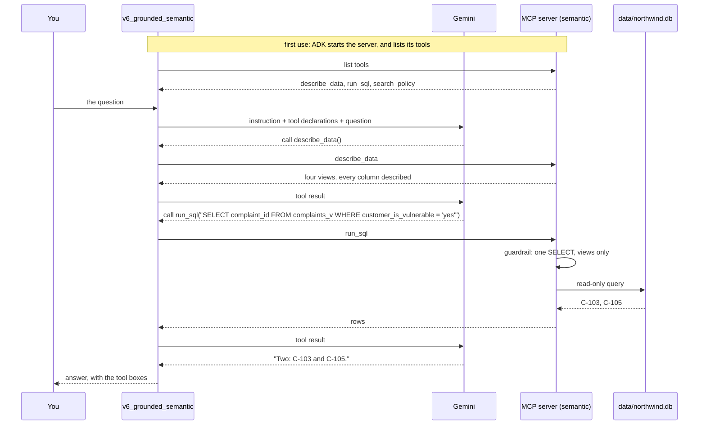

# Architecture of the Day 6 practice application

This document describes how the agent is grounded: the MCP server that owns Northwind's
data and policies, the two shapes the same data can take, how a question becomes a SQL
query or a policy search, and how the before and after is measured.

Read [`README.md`](README.md) first if you have not run the agents yet. The data and
meanings are Day 4's, the recorder is Day 3's, and the guardrail idea is Day 2's, now
applied to SQL.

---

## 1. In one paragraph

One MCP server, `mcp_server/northwind_mcp.py`, owns Northwind's records and policies. It
offers three tools: `describe_data` says what data exists and what it means, `run_sql`
runs one read-only query, and `search_policy` finds the most relevant policy passages. The
server runs in one of two modes. In **raw** mode it exposes seven back-office tables with
cryptic names and codes; in **semantic** mode it exposes four ontology-aligned views with
every column described. Three agents answer the same ten golden questions: one with no
tools, one grounded on the raw mode, one grounded on the semantic mode. The difference in
their scores, question by question, is the evidence that the shape of the data matters.

---

## 2. The idea in one picture

```
                    the same ten golden questions
                                 |
          +----------------------+----------------------+
          v                      v                      v
   v6_ungrounded          v6_grounded_raw        v6_grounded_semantic
   (no tools)                   |                       |
                                | MCP (stdio)           | MCP (stdio)
                                v                       v
                    northwind_mcp.py            northwind_mcp.py
                    NORTHWIND_GROUNDING=raw     NORTHWIND_GROUNDING=semantic
                                |                       |
               +----------------+----------+   +--------+-----------------+
               v                           v   v                          v
     7 raw tables                    6 policy files               4 semantic views
     cmp_tbl, rtn_tbl, vf, grd       (the same for both)          complaints_v, returns_v
               \                                                         /
                +--------- data/northwind.db (one SQLite file) ---------+
```

Everything is identical between the two grounded agents except what the server shows them:
same model, same instruction, same tools, same policies, same records.

---

## 3. Context view

```
        YOU                       YOUR MACHINE                        GOOGLE CLOUD

  +-------------+  HTTP  +------------------------------+  HTTPS  +---------------+
  |  ADK chat   |<------>|  adk web                     |<------->|  Vertex AI    |
  |  page       |        |   v6_ungrounded              |         |  Gemini       |
  +-------------+        |   v6_grounded_raw      ------+--stdio--+-> MCP server  |
                         |   v6_grounded_semantic ------+--stdio--+-> MCP server  |
  +-------------+        +------------------------------+         |  (processes   |
  | eval/       |        the MCP servers are child processes      |   on the VM)  |
  | run_        |        of adk web, or of the eval run           +---------------+
  | grounding   |
  +-------------+                   Optional, in Google Cloud:
                                    BigQuery (SQL_BACKEND=bigquery)
                                    Vertex AI RAG Engine (RAG_BACKEND=vertex)
```

**What crosses to the model.** Only what the agent asks for, as tool results: the data
description, the rows of one query (at most 50), or the best three policy passages. Never
the whole database, and never every policy.

**The MCP boundary.** The agents do not import the database or the policies. They start
the server as a separate process and talk to it over standard input and output, exactly as
they would to a server another team runs on another machine. Replacing the transport with
HTTP would not change a line of the agents.

---

## 4. Components

| Component | File | Responsibility |
|---|---|---|
| MCP server | `mcp_server/northwind_mcp.py` | Offers `describe_data`, `run_sql` and `search_policy`. The mode comes from `NORTHWIND_GROUNDING` |
| Database builder | `northwind/database.py` | Builds `data/northwind.db` from `data/northwind.json`: seven raw tables and four views |
| Semantic layer | `northwind/semantic_layer.yaml` | What each view and column means, in the ontology's words |
| SQL tool | `northwind/sql.py` | The read-only guardrail, and the SQLite or BigQuery backend |
| Policy search | `northwind/policy_search.py` | Local search over `policies/`, or Vertex AI RAG Engine |
| Policies | `policies/*.md` | Six documents, each owned by one team |
| Agent factory | `northwind/grounded.py` | Builds each agent, and connects it to the server with `McpToolset` |
| Instructions | `northwind/instructions/` | One for the grounded agents (use the tools, cite sources), one for the ungrounded agent |
| Recorder | `northwind/recorder.py` | Day 3's recorder, keeping model calls and turns, so token cost is visible |
| Eval harness | `eval/run_grounding.py`, `eval/grounding_questions.yaml` | The before and after on ten golden questions |

---

## 5. The two shapes of the data

The same 47 rows, stored the way an old back-office system might, then described the way
the Day 4 ontology says.

| Fact | Raw table and column | Semantic view and column |
|---|---|---|
| Which complaint | `cmp_tbl.cid` | `complaints_v.complaint_id` |
| The customer behind it | join `cmp_tbl.aref` to `acc_tbl.aref`, then `acc_tbl.cref` to `cust_tbl.cref` | `complaints_v.customer_id`, `customer_name` |
| Vulnerable | `cust_tbl.vf`, **and** a legacy `acc_tbl.vuln` that disagrees for ACC-003B | `complaints_v.customer_is_vulnerable`, from the customer |
| Order value | join to `ord_tbl.val` | `complaints_v.order_value_gbp` |
| Refunds so far | sum `rfnd_tbl.amt` by `cid` | `complaints_v.refunds_so_far_gbp` |
| Condition grade | `rtn_tbl.grd`, as the codes 1, 2 and 3 | `returns_v.condition_grade`, as A, B or C |
| Recalled | `rtn_tbl.rcl`, as Y or N | `returns_v.on_recall_list`, as yes or no |
| Vendor claim still open | `rtn_tbl.dl >= 0`, if you know `dl` means days to deadline | `returns_v.vendor_claim_open` |

**Two traps are planted in the raw shape**, and both come from real legacy patterns:

| Trap | What a reasonable query does | Wrong answer | Golden question |
|---|---|---|---|
| Vulnerability recorded twice | Filters on the column called `vuln` | No vulnerable complaints at all | G1 |
| Grades stored as codes | Filters `grd = 'C'` | No grade C items | G4, G5 |

The views are ordinary SQL over the raw tables (`database.view_sql()`), so they cannot
disagree with them. The semantic layer adds no data; it adds meaning.

---

## 6. How one question flows

G1 on the semantic agent: *"How many complaints come from customers who are vulnerable?"*



On the raw agent the flow is the same, but `describe_data` returns only table and column
names. The model has to choose between `vf` and `vuln`, and nothing tells it which is right.

---

## 7. NLP2SQL and its guardrail

The model writes the SQL. Code decides whether it runs, in `sql.check()`, before the
database is touched:

| Check | Blocks | Why |
|---|---|---|
| One statement | `SELECT ...; DROP TABLE ...` | No second statement can ride along |
| `SELECT` or `WITH` only | `DELETE`, `UPDATE`, `INSERT` | The agent answers questions; it never changes records |
| No data-changing keywords | `DROP`, `ALTER`, `ATTACH`, `PRAGMA` and others | A second line of defence |
| Only the mode's tables | A view in raw mode, a raw table in semantic mode | Keeps the two runs honest |
| At most 50 rows | Large result sets | One query cannot flood the context window |

The SQLite connection is also opened **read-only**, so even a query that got past the
checks could not write. A query that fails returns its error to the model, which can read
it and try again.

**BigQuery option.** With `SQL_BACKEND=bigquery` and `BQ_DATASET` set, `run_sql` sends the
same checked query to BigQuery, with that dataset as the default and a 100 MB billing cap.
`sql.bigquery_setup()` creates the dataset, loads the raw tables and creates the same four
views there, using the same view SQL.

---

## 8. RAG over the policies

```
  policies/*.md  ->  one chunk per "##" section  ->  score each chunk against the question
                                                            |
                         the question's words, plus the ontology's synonyms
                         (money back -> refund), rarer words counting for more
                                                            |
                                                            v
                                        the best three chunks, each with its source
```

| Choice | Why |
|---|---|
| One chunk per section | Each section is one rule, with a heading that names it |
| Synonyms from `ontology.yaml` | The Day 4 synonyms become retrieval: "money back" finds the refund policy |
| Three passages, not the whole document | The context budget: only what the answer needs |
| A source on every passage | The answer can cite `refunds.md#Refund limits`, so a reader can check it |
| Search is a tool | Agentic RAG: the agent decides when to search, and can search again with better words |

**Vertex AI RAG option.** With `RAG_BACKEND=vertex` and `VERTEX_RAG_CORPUS` set,
`search_policy` queries a Vertex AI RAG Engine corpus instead. `policy_search.vertex_setup()`
creates the corpus and uploads the six policy files. The agents do not change; only the
server's backend does.

---

## 9. The experiment, and how it is scored

`eval/run_grounding.py` runs each golden question on each agent, in a fresh session.

| Recorded per answer | How |
|---|---|
| Correct or not | Every `expect` phrase, and at least one `any_of` phrase, appear in the answer |
| Tools used, and what each returned | From the function calls and responses in the events |
| Tokens | From the usage the model reports with every response |
| A first guess at the cause of a failure | From what the tools returned (below) |

| Cause | The harness guesses it when | What it usually means |
|---|---|---|
| Context | No tool was called, or every query returned no rows | The answer was never in front of the model |
| Tool | The last tool call was blocked or failed | The agent did not recover from a bad query |
| Reasoning | Tools returned data, and the answer was still wrong | The right facts were there, and it misread them |

The guess is a starting point for the diagnosis, not a verdict. G5 on the raw agent shows
why: its only query returns no rows, which looks like context, but the real cause is that
it filtered `grd = 'C'` on a column that holds the codes 1 to 3. The data was there; the
agent misread it. Deciding that is the learner's job.

**Why this proves the point.** The raw and semantic agents differ in one thing only. Any
question one answers and the other does not is a question where the shape of the data
decided the answer. The harness prints those as "Fixed by the semantic layer".

---

## 10. Context management and the context budget

| Question | This kit's answer |
|---|---|
| **What** goes into the window | The description of the data once, then only the rows or passages each question needs |
| **When** | When the agent asks, through a tool call, never loaded up front |
| **From where** | From the owner, through the MCP server; never copied into the instruction |
| **How much** | At most 50 rows per query, three passages per search |

A **context budget** is a limit on what one answer may read, in tokens. The token column in
the harness output makes it measurable: learners set a budget per answer in ADR-6, and can
see which questions exceed it and why.

The semantic description is longer than the raw one, so the semantic agent can read more
tokens on some questions. Whether that extra context is worth it, when it turns wrong
answers into right ones, is one of the seven questions.

---

## 11. State: what persists, and for how long

| State | Held in | Lasts |
|---|---|---|
| The records | `data/northwind.json`, built into `data/northwind.db` | Until rebuilt; never written to by the agents |
| The policies | `policies/*.md` | Until edited |
| The MCP server | A child process of `adk web` or the eval run | Until its parent stops |
| Chat sessions | ADK session state | One session |
| Tokens and turns | `runs.jsonl` | Until deleted |
| The before and after | `baseline/grounding_v1.json` | Until the full run is repeated |

---

## 12. Known limits

| Limit | Where it shows | Where it is picked up |
|---|---|---|
| Local search matches words, not meaning | A question worded very differently from the policy may miss it | The Vertex option, or embeddings |
| The golden set checks words in the answer | A right answer worded unusually can fail | Worksheet: classify it as a harness failure |
| The cause of a failure is a guess | G5 raw looks like context but is reasoning | The diagnosis exercise |
| The guardrail checks table names, not every SQL trick | Deliberately unusual SQL could confuse the table check | The read-only connection is the second line of defence |
| Every learner's MCP server is local | No shared server, no authentication between agent and server | Day 9: governance |
| The cloud options are not exercised by the tests | BigQuery and Vertex AI need the project set up | Optional section of the README |

---

## 13. Configuration

| Setting | Where | Purpose |
|---|---|---|
| `GOOGLE_GENAI_USE_VERTEXAI`, `GOOGLE_CLOUD_PROJECT`, `GOOGLE_CLOUD_LOCATION`, `AGENT_MODEL` | `agents/.env`, written by `setup.sh` | The model, as on earlier days |
| `NORTHWIND_GROUNDING` | Set by each agent when it starts its server | `raw` or `semantic` |
| `SQL_BACKEND`, `BQ_DATASET` | Your terminal, optional | Run SQL on BigQuery instead of SQLite |
| `RAG_BACKEND`, `VERTEX_RAG_CORPUS`, `VERTEX_RAG_LOCATION` | Your terminal, optional | Search a Vertex AI RAG corpus instead of the local files |

The MCP server inherits the environment of the process that starts it, so options set in a
terminal reach the server only if `adk web` or the eval run is started from that terminal.

**Packages.** The default route needs `google-adk` with its MCP support
(`pip install "google-adk[mcp]"`, which installs `mcp` 1.x). The options need
`google-cloud-bigquery` and `google-cloud-aiplatform`. `setup.sh` checks the MCP support.
